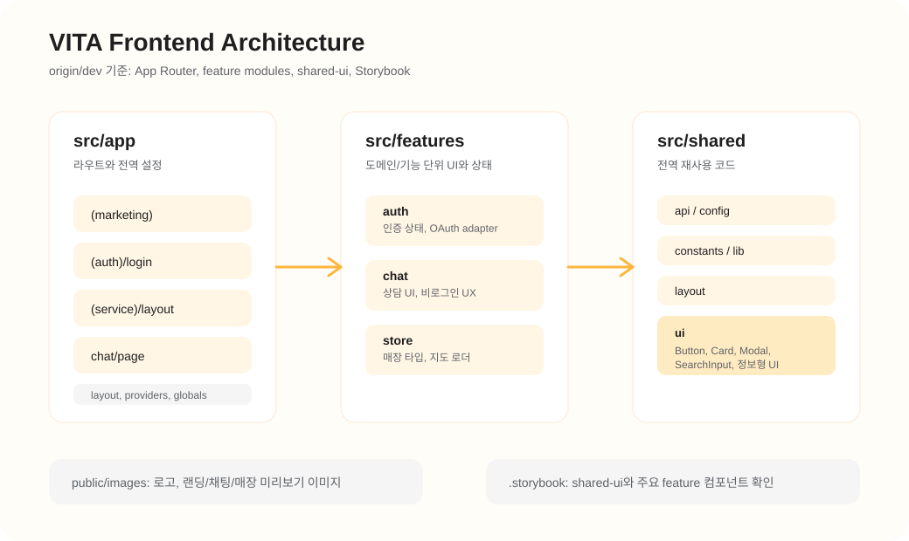
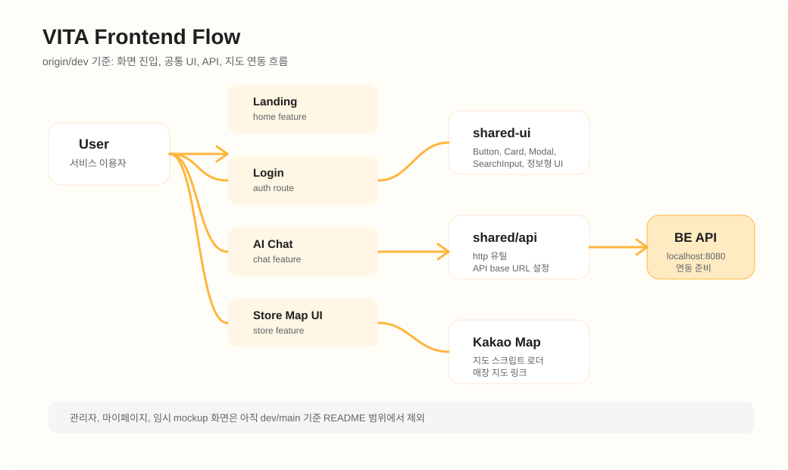

# Vita

AI 통신 상담 서비스 구현 프로젝트의 프론트엔드입니다. 사용자는 통신 서비스 관련 질문을 채팅으로 입력하고, FAQ 기반 답변과 가까운 매장 안내를 받을 수 있습니다.

## 기술 스택

- Next.js 16 App Router
- React 19
- TypeScript
- Tailwind CSS 4
- Storybook 10
- next-themes
- motion
- driver.js
- lucide-react

## 실행 방법

```bash
npm install
npm run dev
```

Storybook 실행:

```bash
npm run storybook
```

검증:

```bash
npm run test
npm run lint
npm run build
npm run build-storybook
```

## 환경 변수

`.env.example`을 기준으로 `.env.local`을 생성합니다.

```bash
NEXT_PUBLIC_API_BASE_URL=http://localhost:8080
NEXT_PUBLIC_KAKAO_MAP_APP_KEY=카카오맵_JAVASCRIPT_KEY
```

## 프로젝트 구조

```text
src/
  app/                 Next.js 라우트와 전역 설정
    (auth)/            인증 관련 화면
    (marketing)/       랜딩 페이지 레이아웃
    (service)/         서비스 화면 레이아웃
    chat/              AI 상담 화면
    admin/             관리자 대시보드, FAQ/매장 관리 화면

  features/            도메인/기능 단위 코드
    admin/             관리자 대시보드, FAQ/매장 관리 mock 상태와 UI
    auth/              인증 상태, 로그인/회원가입/OAuth API adapter
    home/              랜딩 화면 섹션
    chat/              채팅 UI, 투어, 채팅 타입, 비로그인 채팅 UX
    store/             매장 위치 타입, mock 데이터, 카카오맵 로더

  shared/              앱 전역에서 재사용되는 코드
    api/               백엔드 API 요청 공통 유틸
    config/            환경변수 접근
    constants/         라우트, 화면 문구
    layout/            Header, Footer 등 레이아웃 컴포넌트
    lib/               공통 유틸
    ui/                Button, Card, Modal, SearchInput 등 공통 UI
```

## 프론트엔드 구조



## 화면 및 연동 흐름



## 공통 UI와 Storybook

공통 UI는 `src/shared/ui`에서 관리합니다. 버튼, 카드, 모달, 검색 입력처럼 여러 화면에서 반복되는 컴포넌트와 FAQ/요금제/안내 화면에 활용할 수 있는 정보형 컴포넌트를 포함합니다.

- `Button`: variant, size, loading, icon, fullWidth 옵션 지원
- `Card`, `Modal`, `SearchInput`, `Select`, `TextField`: 관리자 화면과 서비스 화면에서 재사용할 수 있는 기본 UI
- `AnimatedLockIcon`, `ConfirmCheckbox`: 관리자 위험 액션 확인 UI
- `Accordion`, `PlanCard`, `InfoTable`, `ChecklistCard`, `GuidedStepFlow`, `StepGuideCard`, `WarningNotice`: FAQ, 요금제, 절차 안내 등에 활용할 수 있는 정보형 UI
- 주요 공통 컴포넌트는 Storybook stories로 확인 가능

```bash
npm run storybook
```

## 문서

- [Architecture](./docs/Architecture.md): FSD-lite 구조, layer 책임, import 규칙
- [Auth](./docs/Auth.md): 자체 로그인, OAuth, 로그아웃, 인증 상태 관리 흐름
- [Design System](./docs/DesignSystem.md): 토큰, 공통 UI, 상태 UI 사용 기준
- [Testing](./docs/Testing.md): 테스트 실행 명령과 자동화/수동 QA 기준
- [API Contract](./docs/api-contract.md): 백엔드 기능 API 연동 전 계약 메모
- [Git 브랜치 전략](./docs/Git브랜치전략.md): 브랜치, 커밋, PR 규칙

## 현재 프론트 범위

- 랜딩 페이지
- 로그인 화면
- 회원가입 화면
- OAuth 콜백 화면
- AI 상담 화면
- 비로그인 채팅 진입
- 관리자 대시보드, FAQ 관리, 매장 관리 화면
- 모바일/태블릿/데스크톱 반응형
- 다크 모드
- 카카오맵 기반 매장 탐색 UI
- Storybook 기반 공통 UI 확인
- 자체 로그인/회원가입/OAuth API 연동
- 채팅/매장/관리자 기능은 Phase 2 백엔드 API 연동 전까지 mock 기반 동작 유지
