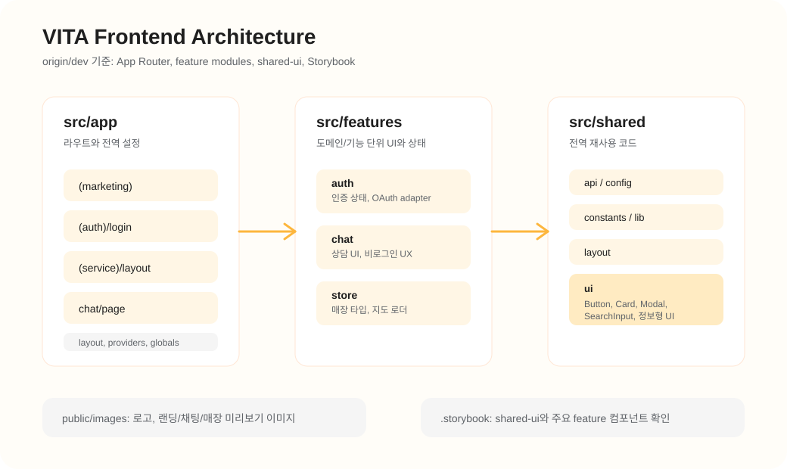
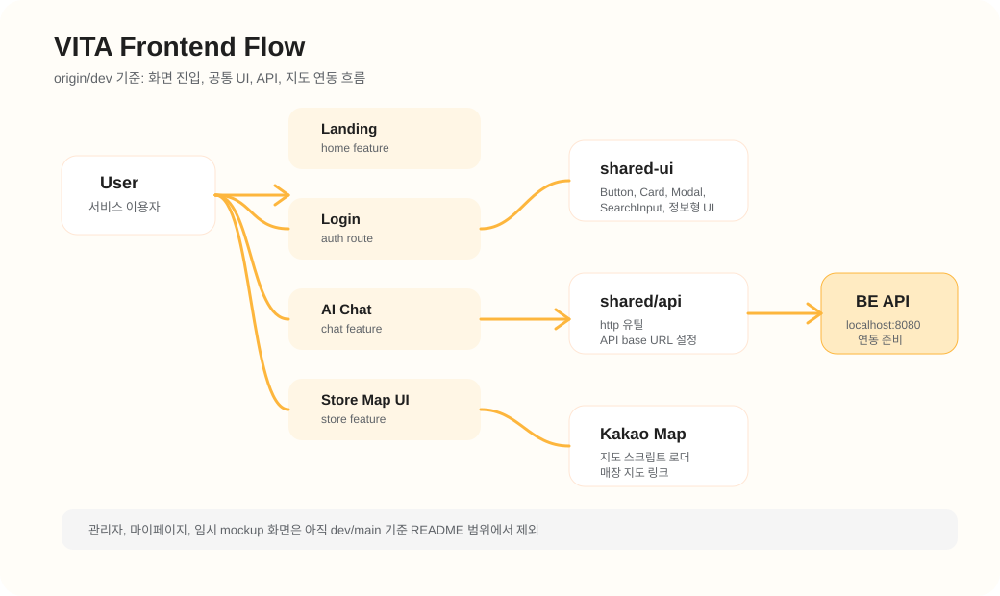
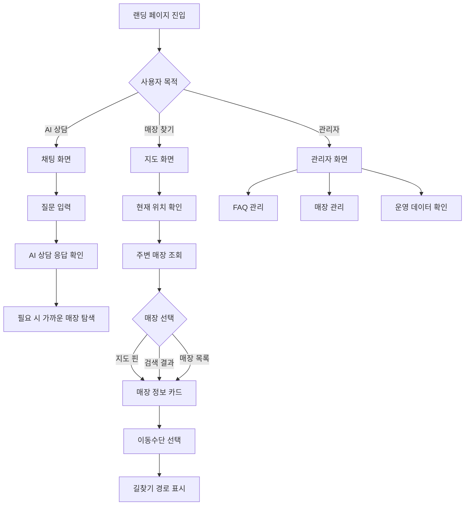

# 🤖 VITA Frontend

> 가상 통신사 FAQ 기반 AI 상담 + 위치 기반 매장 안내 서비스의 프론트엔드

VITA 프론트엔드는 가상 통신사의 AI 상담 서비스와 위치 기반 매장 안내 서비스를 사용자가 하나의 흐름 안에서 이용할 수 있도록 구현한 웹 클라이언트입니다. 사용자는 통신 서비스 관련 질문을 채팅으로 입력하고, FAQ/RAG 기반 답변을 확인하며, 필요한 경우 가까운 매장 탐색과 길찾기까지 이어갈 수 있습니다.

프론트엔드는 단순 화면 구현이 아니라 백엔드의 인증, 채팅, 매장, 관리자 API와 연결될 것을 전제로 서비스 UX를 설계했습니다. API 연동 전 단계에서는 mock 데이터와 adapter 구조를 활용해 화면 흐름을 먼저 검증하고, 실제 API 연결 시 변경 범위를 줄일 수 있도록 도메인별 기능 구조를 분리했습니다.

**핵심 경험 포인트**: AI 채팅 UX, Kakao Maps 기반 위치 서비스, 이동수단별 길찾기, 관리자 운영 UI, 반응형/다크 모드, Storybook 기반 공통 UI

---

## 목차

1. 기술 스택
2. 핵심 서비스
3. 실행 방법
4. 환경 변수
5. 프로젝트 구조
6. 프론트엔드 구조와 화면 흐름
7. 핵심 기능
8. 공통 UI와 Storybook
9. 프론트엔드 역할 및 기여
10. 주요 사용자 흐름
11. 구현 포인트
12. 문서
13. 현재 프론트엔드 구현 범위

---

## 1. 기술 스택

- Next.js 16 App Router
- React 19
- TypeScript
- Tailwind CSS 4
- Storybook 10
- next-themes
- motion
- driver.js
- lucide-react
- Kakao Maps SDK

---

## 2. 핵심 서비스

| 구분    | 기능                           | 설명                                                                   |
| ------- | ------------------------------ | ---------------------------------------------------------------------- |
| 랜딩    | 서비스 소개 화면               | VITA 서비스의 AI 상담, 매장 안내, 관리자 기능을 소개하는 진입 화면     |
| 인증    | 로그인 / 회원가입 / OAuth 콜백 | 자체 로그인, 회원가입, OAuth 콜백 처리 및 인증 상태 관리               |
| AI 상담 | 채팅 화면                      | 사용자가 통신 관련 질문을 입력하고 AI 상담 응답을 확인하는 대화형 UI   |
| AI 상담 | 비로그인 채팅 UX               | 로그인하지 않은 사용자도 채팅 흐름을 경험할 수 있도록 게스트 진입 처리 |
| AI 상담 | 대화 목록 / 검색 / 메시지 UI   | 채팅 사이드바, 검색 다이얼로그, 메시지 리스트, 입력창 구성             |
| 매장    | 위치 기반 매장 조회            | 사용자 현재 위치 또는 지도 중심 좌표 기준 주변 매장 표시               |
| 매장    | 매장 검색 / 목록 / 상세 카드   | 매장명, 주소, 전화번호 검색 및 선택 매장 상세 정보 표시                |
| 매장    | 이동수단별 길찾기              | 도보, 자동차, 자전거, 대중교통 mode 기반 경로 표시                     |
| 관리자  | 관리자 대시보드                | FAQ, 매장 관리 현황을 확인할 수 있는 관리자 화면                       |
| 관리자  | FAQ 관리                       | FAQ 목록, 필터, 정렬, 등록/수정/삭제 흐름을 고려한 관리 UI             |
| 관리자  | 매장 관리                      | 매장 정보와 서비스 항목을 관리할 수 있는 관리자 UI                     |
| 공통    | 디자인 시스템                  | Button, Modal, Card, Input, Select 등 재사용 가능한 공통 UI 구성       |
| 공통    | 반응형 / 다크 모드             | 모바일, 태블릿, 데스크톱 대응 및 테마 전환 지원                        |

---

## 3. 실행 방법

```bash
npm install
npm run dev
```

Storybook 실행:

```bash
npm run storybook
```

검증:

```bash
npm run test
npm run lint
npm run build
npm run build-storybook
```

---

## 4. 환경 변수

`.env.example`을 기준으로 `.env.local`을 생성합니다.

```bash
NEXT_PUBLIC_API_BASE_URL=http://localhost:8080
NEXT_PUBLIC_KAKAO_MAP_APP_KEY=카카오맵_JAVASCRIPT_KEY
```

---

## 5. 프로젝트 구조

```text
src/
  app/                 Next.js 라우트와 전역 설정
    (auth)/            인증 관련 화면
    (marketing)/       랜딩 페이지 레이아웃
    (service)/         서비스 화면 레이아웃
    chat/              AI 상담 화면
    admin/             관리자 대시보드, FAQ/매장 관리 화면

  features/            도메인/기능 단위 코드
    admin/             관리자 대시보드, FAQ/매장 관리 mock 상태와 UI
    auth/              인증 상태, 로그인/회원가입/OAuth API adapter
    home/              랜딩 화면 섹션
    chat/              채팅 UI, 투어, 채팅 타입, 비로그인 채팅 UX
    store/             매장 위치 타입, API adapter, 카카오맵 로더, 지도 UI

  shared/              앱 전역에서 재사용되는 코드
    api/               백엔드 API 요청 공통 유틸
    config/            환경변수 접근
    constants/         라우트, 화면 문구
    layout/            Header, Footer 등 레이아웃 컴포넌트
    lib/               공통 유틸
    ui/                Button, Card, Modal, SearchInput 등 공통 UI
```

---

## 6. 프론트엔드 구조와 화면 흐름





---

## 7. 핵심 기능

### Next.js App Router 기반 서비스 구조

- Next.js 16 App Router를 기준으로 마케팅, 인증, 서비스, 관리자 화면을 라우트 그룹으로 분리했습니다.
- `src/app`은 라우팅과 레이아웃을 담당하고, `src/features`는 인증, 채팅, 매장, 관리자 등 도메인 단위 기능을 담당하도록 구성했습니다.
- 도메인별 UI, hook, service, type을 분리해 백엔드 API 연동 전후에도 기능 단위 유지보수가 가능하도록 설계했습니다.

### AI 상담 사용자 경험 구현

- 채팅 서비스 화면에서 메시지 리스트, 입력창, 추천 프롬프트, 채팅 사이드바, 검색 다이얼로그를 구성했습니다.
- 로그인 사용자와 비로그인 사용자의 진입 흐름을 분리해, 게스트 사용자도 서비스 흐름을 체험할 수 있도록 처리했습니다.
- 향후 백엔드 Chat API의 응답 상태와 연결될 수 있도록 로딩/실패/재시도 UX를 고려한 컴포넌트 구조를 마련했습니다.

### Kakao Maps 기반 위치 서비스 구현

- Kakao Maps SDK를 직접 로드하고, 지도 위에 매장 Marker, CustomOverlay, Polyline을 렌더링했습니다.
- 사용자의 현재 위치를 기준으로 주변 매장을 표시하고, 지도 이동 후 현재 지도 중심 기준으로 재검색할 수 있도록 구성했습니다.
- 매장 핀, 검색 결과, 매장 목록 선택이 하나의 선택 상태로 연결되도록 구현했습니다.
- 선택 매장 정보 카드는 화면 밖으로 이탈하지 않도록 지도 컨테이너 내부에서 위치를 보정했습니다.

### 이동수단별 길찾기 UX 구현

- 도보, 자동차, 자전거, 대중교통 mode를 프론트 타입과 UI에 반영했습니다.
- 이동수단 변경 시 해당 mode 기준으로 길찾기 API를 다시 요청하고, 기존 경로 상태를 초기화하도록 처리했습니다.
- 도보 경로는 점선형 자취, 자동차/자전거 경로는 서로 다른 색상의 선형 경로로 표시해 이동수단별 시각적 차이를 제공했습니다.
- 경로가 없는 경우에는 지도에 빈 경로를 표시하지 않고, 정보 카드에 안내 문구를 표시해 사용자가 다른 이동수단을 선택할 수 있도록 했습니다.

### 길찾기 중 지도 UX 보완

- 경로 탐색 중 로딩 오버레이를 표시해 사용자가 경로 계산 중임을 인지할 수 있도록 했습니다.
- 출발지에서 도착지까지 경로가 순차적으로 그려지는 애니메이션을 구현했습니다.
- 길찾기 후 사용자가 지도를 이동하거나 확대/축소했을 때 경로 영역으로 다시 고정되는 문제를 완화했습니다.
- 매장 목록 패널, 정보 카드, 경로가 서로 가리지 않도록 지도 bounds padding과 카드 위치 계산을 조정했습니다.
- 길찾기 중에도 매장 목록에서 다른 매장을 선택해 주변 매장 정보를 확인할 수 있도록 선택 상태를 분리했습니다.

### 관리자 화면 및 운영 도구 UI

- 관리자 대시보드, FAQ 관리, 매장 관리 화면을 구현했습니다.
- 필터, 정렬, 빈 상태, 입력 필드, 위험 액션 확인 등 운영 화면에서 반복되는 UI를 컴포넌트화했습니다.
- 관리자 기능은 백엔드 API 연동 전에도 화면 흐름을 확인할 수 있도록 mock 상태와 context 기반으로 구성했습니다.
- FAQ/매장 데이터의 CRUD 화면 구조를 미리 잡아 백엔드 관리자 API 연동 시 UI 변경을 최소화할 수 있도록 했습니다.

---

## 8. 공통 UI와 Storybook

공통 UI는 `src/shared/ui`에서 관리합니다. 버튼, 카드, 모달, 검색 입력처럼 여러 화면에서 반복되는 컴포넌트와 FAQ/요금제/안내 화면에 활용할 수 있는 정보형 컴포넌트를 포함합니다.

- `Button`: variant, size, loading, icon, fullWidth 옵션 지원
- `Card`, `Modal`, `SearchInput`, `Select`, `TextField`: 관리자 화면과 서비스 화면에서 재사용할 수 있는 기본 UI
- `AnimatedLockIcon`, `ConfirmCheckbox`: 관리자 위험 액션 확인 UI
- `Accordion`, `PlanCard`, `InfoTable`, `ChecklistCard`, `GuidedStepFlow`, `StepGuideCard`, `WarningNotice`: FAQ, 요금제, 절차 안내 등에 활용할 수 있는 정보형 UI
- 주요 공통 컴포넌트는 Storybook stories로 확인 가능

```bash
npm run storybook
```

---

## 9. 프론트엔드 역할 및 기여

| 영역             | 기여 내용                                                                        |
| ---------------- | -------------------------------------------------------------------------------- |
| 서비스 구조 설계 | Next.js App Router 기반 라우트 그룹과 도메인 중심 feature 구조 구성              |
| 인증 화면        | 로그인, 회원가입, OAuth 콜백, 인증 상태 관리 흐름 구현                           |
| AI 상담 UI       | 채팅 화면, 메시지 리스트, 입력창, 사이드바, 검색 다이얼로그, 게스트 채팅 UX 구현 |
| 매장 지도        | Kakao Maps SDK 연동, 매장 Marker/Overlay/Polyline 렌더링 구현                    |
| 길찾기           | 이동수단별 경로 요청, 경로 애니메이션, 거리/시간 정보, 결과 없음 상태 처리       |
| 지도 UX          | 내 위치 이동, 줌인/줌아웃, 지도 재검색, 정보 카드 위치 보정 구현                 |
| 관리자 UI        | 관리자 대시보드, FAQ 관리, 매장 관리 화면 및 mock 상태 관리 구현                 |
| 공통 UI          | Button, Modal, Card, SearchInput 등 재사용 컴포넌트와 Storybook 구성             |
| 반응형 대응      | 모바일/태블릿/데스크톱 레이아웃 및 다크 모드 대응                                |
| API 연동 기반    | 백엔드 API 연결을 고려한 service adapter, type, 상태 구조 분리                   |

---

## 10. 주요 사용자 흐름


```mermaid
flowchart TD
    A[랜딩 페이지 진입] --> B{사용자 목적}
    B -->|AI 상담| C[채팅 화면]
    B -->|매장 찾기| D[지도 화면]
    B -->|관리자| E[관리자 화면]

    C --> C1[질문 입력]
    C1 --> C2[AI 상담 응답 확인]
    C2 --> C3[필요 시 가까운 매장 탐색]

    D --> D1[현재 위치 확인]
    D1 --> D2[주변 매장 조회]
    D2 --> D3{매장 선택}
    D3 -->|지도 핀| D4[매장 정보 카드]
    D3 -->|검색 결과| D4
    D3 -->|매장 목록| D4
    D4 --> D5[이동수단 선택]
    D5 --> D6[길찾기 경로 표시]

    E --> E1[FAQ 관리]
    E --> E2[매장 관리]
    E --> E3[운영 데이터 확인]
```

---

## 11. 구현 포인트

### API 연동 전후를 고려한 구조

프론트엔드는 초기 구현 단계에서 mock 데이터로 화면 흐름을 검증하되, 실제 백엔드 API로 전환하기 쉽도록 service 계층과 type을 분리했습니다.

- `authService`: 로그인, 회원가입, OAuth, 인증 상태 API adapter
- `chatService`: 채팅 세션과 메시지 흐름 adapter
- `storeService`: 주변 매장 조회와 길찾기 요청 adapter
- `adminStoreService`: 관리자 매장 관리 화면용 adapter

### 지도 화면의 복잡한 상태 분리

지도 화면은 현재 위치, 지도 중심, 선택 매장, 검색어, 필터, 길찾기 경로, 이동수단, 로딩 상태가 동시에 존재합니다. 이를 컴포넌트 내부 상태와 store hook으로 분리해 관리했습니다.

- 현재 위치 요청 상태
- 선택 매장 상태
- 검색 결과 상태
- 서비스 필터 상태
- 길찾기 목적지 상태
- 이동수단 mode 상태
- 경로 결과 없음 상태
- 지도 재검색 기준 좌표

### 사용자 행동을 막지 않는 길찾기 UX

길찾기 중에도 사용자가 지도 이동, 줌 조작, 다른 매장 검색, 다른 매장 정보 확인을 이어갈 수 있도록 구성했습니다. 경로 탐색 기능이 지도 탐색 기능을 막지 않도록 경로 상태와 매장 선택 상태를 분리했습니다.

### 화면 이탈 없는 정보 확인

매장 상세 정보, 길찾기 거리/시간, 결과 없음 안내를 모두 지도 화면 내부의 정보 카드에서 확인할 수 있도록 구성했습니다. 정보 카드가 화면 밖으로 튀거나 경로를 가리지 않도록 위치를 보정했습니다.

---

## 12. 문서

- [Architecture](./docs/Architecture.md): FSD-lite 구조, layer 책임, import 규칙
- [Auth](./docs/Auth.md): 자체 로그인, OAuth, 로그아웃, 인증 상태 관리 흐름
- [Design System](./docs/DesignSystem.md): 토큰, 공통 UI, 상태 UI 사용 기준
- [Testing](./docs/Testing.md): 테스트 실행 명령과 자동화/수동 QA 기준
- [API Contract](./docs/api-contract.md): 백엔드 기능 API 연동 전 계약 메모
- [Git 브랜치 전략](./docs/Git브랜치전략.md): 브랜치, 커밋, PR 규칙

---

## 13. 현재 프론트엔드 구현 범위

- 랜딩 페이지
- 로그인 / 회원가입 / OAuth 콜백 화면
- 인증 상태 관리
- AI 상담 채팅 화면
- 비로그인 채팅 진입 UX
- 채팅 사이드바 / 채팅 검색 / 메시지 리스트 / 입력창
- 관리자 대시보드
- FAQ 관리 화면
- 매장 관리 화면
- Kakao Maps 기반 매장 지도
- 현재 위치 기반 주변 매장 조회
- 매장 검색 및 매장 목록 패널
- 선택 매장 정보 카드
- 이동수단별 길찾기 UI
- 경로 애니메이션
- 지도 줌인/줌아웃 및 내 위치 이동 버튼
- 반응형 레이아웃
- 다크 모드
- Storybook 기반 공통 UI 확인
- 자체 로그인/회원가입/OAuth API 연동
- 채팅/매장/관리자 기능은 Phase 2 백엔드 API 연동 전까지 mock 기반 동작 유지
